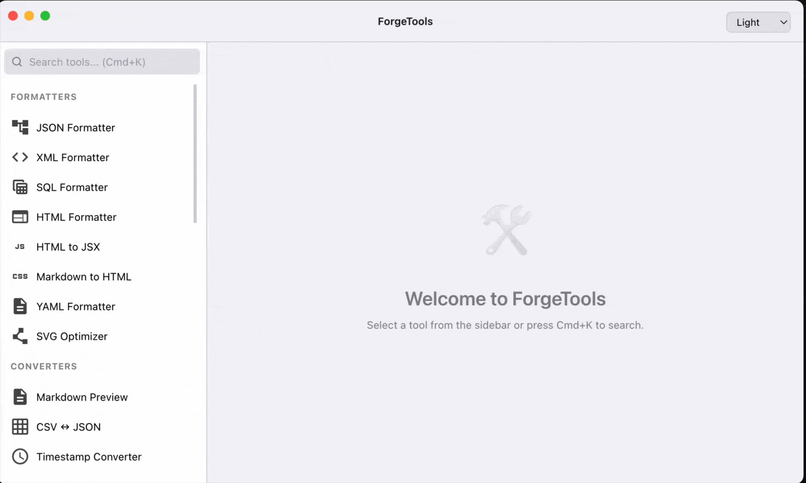

# ForgeTools

ForgeTools is a comprehensive desktop application built with Electron, TypeScript, and Tailwind CSS that provides a suite of essential development tools for software engineers. It offers a collection of formatters, encoders/decoders, converters, and other utilities that work entirely **offline**.

> This project was developed with assistance from Anthropic's Claude AI, which helped with code generation, optimization, and documentation.

## Tech Stack

- **Electron-Vite** - Fast build tool for Electron applications
- **TypeScript** - Type-safe JavaScript
- **Tailwind CSS** - Utility-first CSS framework
- **Monaco Editor** - VS Code's editor for code editing
- **Playwright** - End-to-end testing



## Features

### Formatters

- JSON Formatter & Validator
- XML Formatter
- SQL Formatter
- HTML Formatter
- HTML to JSX Converter
- Markdown to HTML Converter
- Markdown Preview
- YAML Formatter
- SVG Optimizer

### Encoders/Decoders

- Base64 Text Encoder/Decoder
- URL Encoder/Decoder
- JWT Decoder
- Backslash Escape/Unescape
- HEX ↔ ASCII Converter
- Certificate Decoder (X.509)
- Hash Generator (MD5, SHA-1, SHA-256, SHA-512)

### Converters

- YAML ↔ JSON Converter
- CSV ↔ JSON Converter
- Timestamp Converter
- Color Converter & Picker
- Number Base Converter
- Image to Base64 Converter

### Generators

- UUID/ULID Generator
- QR Code Generator
- Barcode Generator (EAN-13, UPC, CODE128, CODE39)
- Lorem Ipsum Generator
- Random String Generator

### Text Tools

- Text Diff Viewer
- String Case Converter (Camel, Pascal, Snake, Kebab, Constant)
- String Inspector
- Cron Expression Parser
- Regular Expression Tester

## Installation

### Prerequisites

- Node.js (v18 or higher)
- npm (v6 or higher)
- Git

### Development Setup

1. Clone the repository:

   ```bash
   git clone https://github.com/tengfone/forgetools.git
   cd forgetools
   ```

2. Install dependencies:

   ```bash
   npm install
   ```

3. Start the development server:

   ```bash
   npm run dev
   # or
   npm start
   ```

4. Build the application (required before running tests):

   ```bash
   npm run build
   ```

### Building for Production

1. Build the application:

   ```bash
   npm run build
   ```

   This compiles TypeScript and bundles the application to the `out/` directory.

2. Create distribution packages:

   ```bash
   npm run dist
   ```

   This builds the application and creates platform-specific installers in the `dist/` directory.

3. Preview the production build (without packaging):

   ```bash
   npm run preview
   ```

## Project Structure

```
forgetools/
├── src/                    # Source code
│   ├── main/              # Main process (Electron entry point)
│   │   └── main.ts        # Main process TypeScript
│   ├── preload/           # Preload script for secure IPC
│   │   └── index.ts       # Preload script TypeScript
│   ├── renderer/          # Renderer process
│   │   ├── index.html     # Main HTML file
│   │   └── src/           # Renderer source files
│   │       ├── app.ts     # Main application logic
│   │       ├── tools.ts    # Tool definitions
│   │       └── main.css    # Tailwind CSS styles
│   ├── types/             # TypeScript type definitions
│   │   ├── electronAPI.ts # Electron API types
│   │   ├── ipc.ts         # IPC channel types
│   │   └── tools.ts       # Tool type definitions
│   └── renderer/          # Renderer assets
│       ├── vs/            # Monaco Editor files
│       └── fonts/         # Font files
├── out/                    # Build output (generated)
│   ├── main/              # Compiled main process
│   ├── preload/           # Compiled preload script
│   └── renderer/          # Compiled renderer
├── tests/                  # Test files
│   └── e2e/               # End-to-end tests
├── assets/                 # Application assets
├── dist/                   # Distribution builds (generated)
├── electron.vite.config.ts # Electron-Vite configuration
├── tailwind.config.js      # Tailwind CSS configuration
├── tsconfig.json           # TypeScript configuration
└── package.json            # Project configuration
```

## CI/CD and Releases

ForgeTools uses GitHub Actions for continuous integration and automated releases. The workflow includes:

1. **Automated Testing**:

   - Runs Playwright end-to-end tests in a headless environment
   - Tests are executed on Ubuntu with Node.js 18
   - Test artifacts are uploaded for debugging

2. **Automated Versioning**:

   - Automatically bumps version numbers
   - Creates Git tags for releases
   - Generates detailed changelogs

3. **Multi-Platform Builds**:

   - Builds for macOS (Intel and Apple Silicon)
   - Builds for Windows (x64)
   - Builds for Linux (x64)

4. **Release Process**:
   - Triggered on pushes to main branch
   - Creates GitHub releases with changelogs
   - Uploads platform-specific binaries
   - Includes SHA-256 checksums for verification

### Available Downloads

Each release includes:

- macOS: Universal DMG (Intel & Apple Silicon)
- Windows: Portable EXE
- Linux: AppImage

### Release Notes

Release notes are automatically generated and include:

- ✨ New Features
- 🐛 Bug Fixes
- 📝 Documentation Updates
- ⚡️ Performance Improvements

### Release Cycles

#### Automated Release Process

1. **Trigger**:

   - Pushes to the `main` branch
   - Creation of version tags (e.g., `v1.2.3`)

2. **Version Management**:

   - Automatic version bumping using `phips28/gh-action-bump-version` based on commit types:
     - `feat:` → Minor version (1.0.14 → 1.1.0)
     - `fix:`, `docs:`, `perf:`, `chore:` → Patch version (1.0.14 → 1.0.15)
     - `feat!:` or `BREAKING CHANGE` → Major version (1.0.14 → 2.0.0)

3. **Build Pipeline**:

   - Runs test suite on Ubuntu with Node.js 18
   - Generates platform-specific builds in parallel:
     - macOS (x64, arm64)
     - Windows (x64)
     - Linux (x64)

4. **Release Artifacts**:
   - Platform-specific binaries
   - SHA-256 checksums
   - Detailed changelog
   - Installation instructions
   - **Note**: Releases are created as **drafts** and must be manually published on GitHub

#### Release Schedule

- **Patch Releases**: As needed for bug fixes and minor improvements
- **Feature Releases**: When new features are ready and tested
- **Major Releases**: Planned for significant changes or breaking updates

#### Quality Gates

Each release must pass:

1. Automated test suite
2. Build verification for all platforms
3. Artifact generation and checksum verification

#### Hotfix Process

For critical issues:

1. Fix is applied directly to `main`
2. Triggers immediate patch release
3. Release notes mark it as a hotfix

### Editing Release Notes

The changelog is automatically generated from commit messages using the following rules:

1. **Commit Categories**:

   - `feat:` commits appear under "✨ New Features"
   - `fix:` commits appear under "🐛 Bug Fixes"
   - `docs:` commits appear under "📝 Documentation"
   - `perf:` commits appear under "⚡️ Performance"

2. **Writing Good Commit Messages**:

   ```bash
   # For features
   git commit -m "feat: add new JSON formatter with syntax highlighting"

   # For bug fixes
   git commit -m "fix: resolve memory leak in base64 encoder"

   # For documentation
   git commit -m "docs: update installation instructions for macOS"

   # For performance
   git commit -m "perf: optimize XML parsing algorithm"
   ```

3. **Manual Edits**:

   - Changelogs can be edited after generation
   - Navigate to the release on GitHub
   - Click "Edit" on the release
   - Modify the release notes
   - Click "Update release"

4. **Best Practices**:
   - Keep commit messages clear and concise
   - Start with a verb in present tense
   - Describe the change, not the work done
   - Reference issues when applicable: "fix: resolve memory leak (#123)"

## Testing

ForgeTools uses Playwright for end-to-end testing of the Electron application. The tests run in headless mode, making them suitable for CI/CD environments.

### Running Tests

1. Build the application first (required):

   ```bash
   npm run build
   ```

2. Run the tests:

   ```bash
   npm test
   ```

3. Run tests with UI (interactive mode):

   ```bash
   npm run test:ui
   ```

4. To view the test report:

   ```bash
   npx playwright show-report
   ```

### Test Structure

Tests are located in the `tests/e2e` directory:

```
tests/
├── e2e/                   # End-to-end tests
│   ├── app.spec.js        # Main application tests
│   └── helpers/           # Test helpers
│       └── electronApp.js # Electron app launch helper
└── globalSetup.js          # Test setup (Monaco Editor files)
```

### Test Coverage

The test suite covers:

- Application launch and basic UI rendering
- Sidebar navigation and tool loading
- Core application functionality

Tests are kept minimal and focused on essential functionality to ensure reliability.

## Development

### Key Features

- **Native Window Controls**: Uses platform-native window controls (macOS traffic lights, Windows/Linux standard controls)
- **Dark Mode**: System-aware dark/light theme switching
- **Offline-First**: All functionality works without internet connection
- **Type-Safe**: Full TypeScript implementation for better code quality
- **Modern UI**: Built with Tailwind CSS for a clean, responsive interface

### Development Commands

```bash
npm run dev      # Start development server with hot reload
npm run build    # Build for production
npm run preview  # Preview production build
npm test         # Run end-to-end tests
npm run test:ui  # Run tests with interactive UI
```

### Code Structure

- **Main Process** (`src/main/`): Electron main process with IPC handlers
- **Preload** (`src/preload/`): Secure bridge between main and renderer
- **Renderer** (`src/renderer/`): UI and application logic
- **Types** (`src/types/`): Shared TypeScript type definitions

## Contributing

1. Fork the repository
2. Create a feature branch
3. Commit your changes (following conventional commits)
4. Push to the branch
5. Create a Pull Request

### Commit Message Format

Follow the Conventional Commits specification:

- `feat:` New features
- `fix:` Bug fixes
- `docs:` Documentation changes
- `perf:` Performance improvements
- `chore:` Maintenance tasks

## License

This project is licensed under the MIT License - see the LICENSE file for details.
